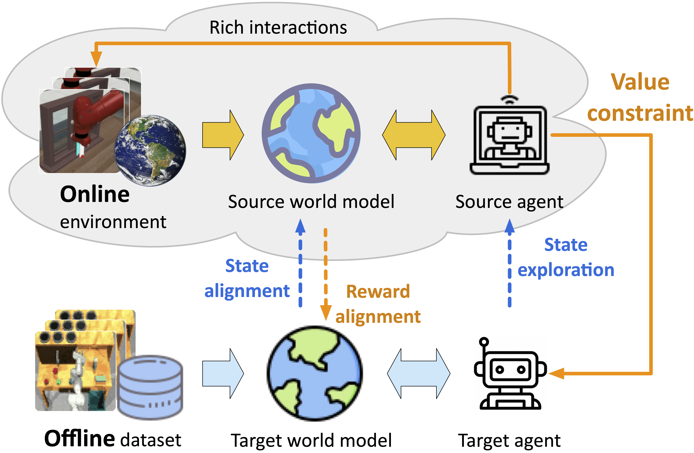

<h1 align="center"> [NeurIPS 2024] Making Offline RL Online: Collaborative World Models for Offline Visual Reinforcement Learning </h1>
<p align="center">
    Qi Wang*
    ·
    Junming Yang*
    ·
    Yunbo Wang
    ·
    Xin Jin
    ·
    Wenjun Zeng
    ·
    Xiaokang Yang
  </p>

<h3 align="center"> <a href="https://openreview.net/pdf?id=ucxQrked0d" target="_blank"> Paper </a> &nbsp;&nbsp;|<a href="https://arxiv.org/pdf/2305.15260" target="_blank"> arXiv </a> &nbsp;&nbsp; | &nbsp;&nbsp; <a href="https://qiwang067.github.io/coworld" target="_blank"> Website </a> &nbsp;&nbsp; </h3>
  <div align="center"></div>

<p align="center">

</p>

<p style="text-align:justify">
Training offline RL models using visual inputs poses two significant challenges, <i>i.e.</i>, the overfitting problem in representation learning and the overestimation bias for expected future rewards. Recent work has attempted to alleviate the overestimation bias by encouraging conservative behaviors. This paper, in contrast, tries to build more flexible constraints for value estimation without impeding the exploration of potential advantages. The key idea is to leverage off-the-shelf RL simulators, which can be easily interacted with in an online manner, as the “<i>test bed</i>” for offline policies. To enable effective online-to-offline knowledge transfer, we introduce CoWorld, a model-based RL approach that mitigates cross-domain discrepancies in state and reward spaces. Experimental results demonstrate the effectiveness of CoWorld, outperforming existing RL approaches by large margins.
</p>

**Please consider citing our paper if you find it interesting or helpful to your research.**

```bib
@inproceedings{wang2024making,
  title={Making Offline RL Online: Collaborative World Models for Offline Visual Reinforcement Learning}, 
  author={Qi Wang and Junming Yang and Yunbo Wang and Xin Jin and Wenjun Zeng and Xiaokang Yang},
  booktitle={NeurIPS},
  year={2024}
}
```

## Getting Strated
CoWorld is implemented and tested on Ubuntu 20.04 with python == 3.7, PyTorch == 1.13.1:

1) Create an environment
```bash
conda create -n coworld python=3.7
conda activate coworld
```
2) Install dependencies
```bash
pip install -r requirements.txt
```

3) Copy all files in `./modified_dmc_xml` to the DMC directory in your conda environment, such as `/home/.conda/envs/your_env_name/lib/python3.7/site-packages/dm_control/suite/`.
4) Download the offline dataset [here](https://drive.google.com/file/d/1XXXLyx8oX40EXl8GNVgU_PpoPJHolZGJ/view?usp=sharing). 

## Meta-World/RoboDesk/DMC
1. Training command on Meta-World:  
```bash
python3 co_training.py --source_task metaworld_drawer-close --target_task metaworld_door-close \
--offline_traindir 'offline_metaworld_data_path' \
--configs defaults metaworld 
```
2. Training command on RoboDesk:  
```bash
python3 co_training.py --source_task metaworld_button-press --target_task robodesk_push_green \
--offline_traindir 'offline_robodesk_data_path' \
--configs defaults robodesk
```
3. Training command on DMC:  
```bash
python3 co_training.py --source_task walker_walk --target_task walker_downhill \
--offline_traindir 'offline_dmc_data_path' \
--configs defaults dmc
```
<!--
## Citation
```bib
@inproceedings{wang2024making,
  title={Making Offline RL Online: Collaborative World Models for Offline Visual Reinforcement Learning}, 
  author={Qi Wang and Junming Yang and Yunbo Wang and Xin Jin and Wenjun Zeng and Xiaokang Yang},
  booktitle={NeurIPS},
  year={2024}
}
```
-->

## Acknowledgement
The codes refer to the implemention of [dreamer-torch](https://github.com/jsikyoon/dreamer-torch). Thanks for the authors！


